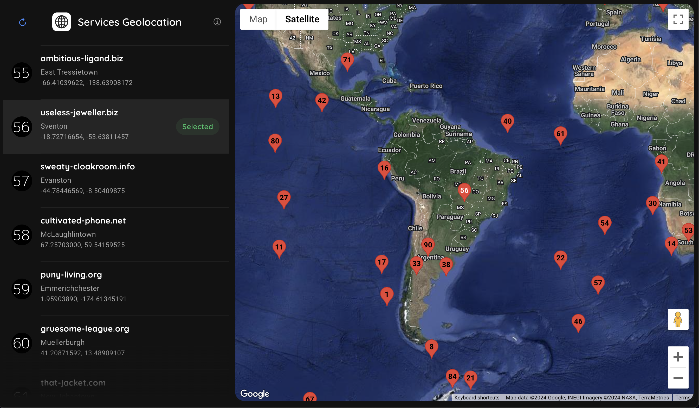

# Dogkas Technical Test Project

Este proyecto se desarrolló como parte del proceso de entrevista técnica para Dogkas. Incluye una aplicación backend y una aplicación frontend que interactúan entre sí para mostrar geolocalizaciones generadas aleatoriamente en un mapa.

## Vista




## Descripción

El backend es una API REST construida con Node.js, que sirve datos de geolocalización aleatorios. El frontend es una aplicación web desarrollada con Ionic 7 y Angular 17, que muestra estos datos en un mapa interactivo utilizando la librería oficial de Google Maps para Angular.

### Backend

- **Endpoints**
  - `GET /locations`: Devuelve una lista de servicios incluyendo latitud, longitud y metadata.
  - `GET /locations/populate`: Utiliza un nuevo seed para generar una nueva lista de servicios, actualizando la base de datos y devolviendo la lista actualizada *(extra)*.

### Frontend
La aplicación frontend muestra un mapa interactivo que utiliza los datos de la API del backend, los cuales se puedan explorar en una lista de servicios, haciendo clic en cada uno de ellos para centrar el mapa en su ubicación correspondiente.
Esta aplicación se desarrolló utilizando [Ionic 7](https://ionicframework.com/) y [Angular 17](https://blog.angular.io/introducing-angular-v17-4d7033312e4b).

Consideraciones adicionales:

1. Para cumplir con los requisitos de utilizar la librería oficial de [Google Maps de Angular](https://www.npmjs.com/package/@angular/google-maps), y a la vez que el mapa lea la API Key desde el archivo `environment.ts`, en lugar de utilizar [Dynamic Library Import script](https://developers.google.com/maps/documentation/javascript/load-maps-js-api#dynamic-library-import) se optó por un método que permitiera leer la API Key desde el archivo `environment.ts`, concatenando la siguiente función en `bootstrapApplication(...)` de `main.ts`:

https://github.com/CxrlosKenobi/dogkas-technical-interview/blob/8b88d7d8974d56e684322e6ab8140da98b984c7c/frontend/src/main.ts#L16-L27

2. Con el fin de cumplir con los requisitos de `app.component.ts`, no se implementó un desarrollo responsivo para móviles ya que se hubiera requerido separar la lógica en componentes distintos, para luego aplicar condiciones de visibilidad en base a la pantalla del dispositivo. Lo cual escapa del alcance del test.


## Instrucciones de uso

Para levantar el backend, sigue [estas instrucciones](./backend/INSTRUCCIONES.md).
Al ejecutar `npm run seed`, mediante la librería [Faker.js](https://fakerjs.dev/) se generarán 100 registros aleatorios en la base de datos usando [Knex.js](https://knexjs.org/guide/migrations.html#seed-files) para la migración y el seed.

Para levantar la app frontend, dentro de la carpeta `frontend` ejecutar:

```bash
yarn
yarn start
```

Esto compilará la aplicación y la servirá en `http://localhost:4200`.

*(opcional) Siguiendo [estos pasos](https://github.com/angular/components/blob/main/src/google-maps/README.md#getting-the-api-key) obtener una API Key de Google Maps y agregarla en el archivo `environment.ts` de la carpeta `frontend/src/environments`*.

## Troubleshooting

### Backend

Error al levantar el contenedor de Docker en macOS
> docker compose --file docker-compose.yaml up -d

- **Problema**: `Error response from daemon: network dogkas-network not found.`
- **Solución**: Ejecuta `docker network create dogkas-network para crear la red necesaria`.


Error de permisos de montaje en Docker (macOS)
> docker compose --file docker-compose.yaml up -d

- **Problema**: `Mounts denied: The path [...] is not shared from the host and is not known to Docker.`
- **Solución**: Agrega la ruta indicada a las rutas compartidas en `Docker Desktop > Preferencias... > Recursos > Compartir Archivos`.

---

Desarrollado con ❤️ por [CxrlosKenobi](https://github.com/CxrlosKenobi) como parte del proceso de entrevista técnica para Dogkas.
